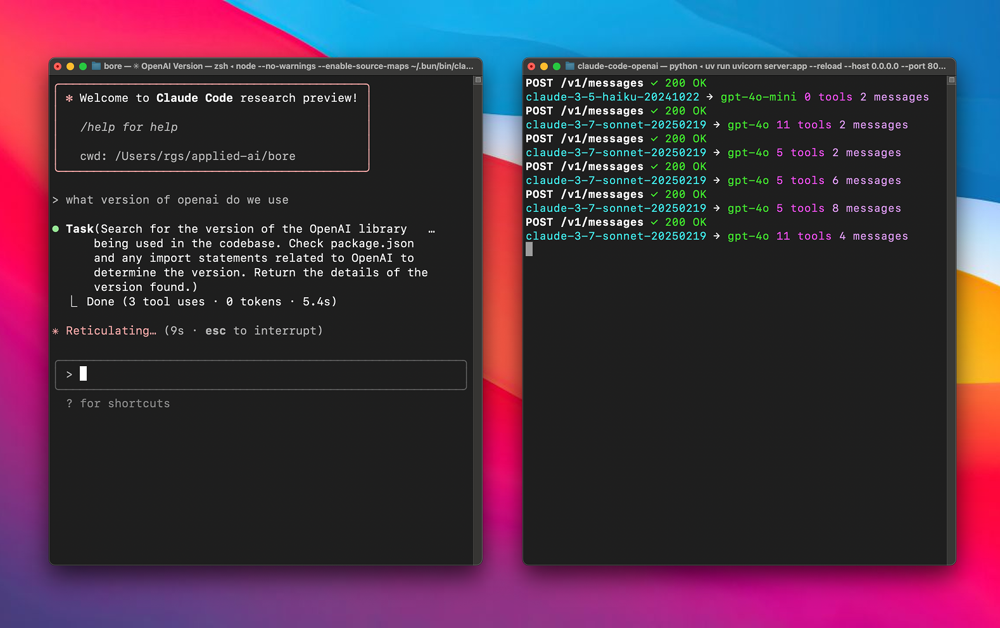

# Anthropic API Proxy for Gemini & OpenAI Models 🔄

**Use Anthropic clients (like Claude Code) with Gemini or OpenAI backends.** 🤝

A proxy server that lets you use Anthropic clients with Gemini or OpenAI models via LiteLLM. 🌉




## Quick Start ⚡

### Prerequisites

- OpenAI API key 🔑
- Google AI Studio (Gemini) API key (if using default provider) 🔑
- [uv](https://github.com/astral-sh/uv) (recommended) or pip installed.

### Setup 🛠️

1. **Clone this repository**:
   ```bash
   git clone https://github.com/1rgs/claude-code-openai.git
   cd claude-code-openai
   ```

2. **Install dependencies**:
   Using uv (recommended):
   ```bash
   uv venv # Create virtual environment (optional but recommended)
   uv pip install fastapi uvicorn litellm python-dotenv httpx # Install main packages
   ```
   Or using pip:
   ```bash
   python -m venv .venv
   source .venv/bin/activate # Or .\venv\Scripts\activate on Windows
   pip install fastapi uvicorn litellm python-dotenv httpx
   ```

3. **Configure Environment Variables**:
   Copy the example environment file:
   ```bash
   cp .env.example .env
   ```
   Edit `.env` and fill in your API keys and model configurations:

   *   `ANTHROPIC_API_KEY`: (Optional) Needed only if proxying *to* Anthropic models.
   *   `OPENAI_API_KEY`: Your OpenAI API key (Required if using OpenAI models as fallback or primary).
   *   `GEMINI_API_KEY`: Your Google AI Studio (Gemini) API key (Required if using the default Gemini preference).
   *   `PREFERRED_PROVIDER` (Optional): Set to `google` (default) or `openai`. This determines the primary backend for mapping `haiku`/`sonnet`.
   *   `BIG_MODEL` (Optional): The model to map `sonnet` requests to. Defaults to `gemini-1.5-pro-latest` (if `PREFERRED_PROVIDER=google` and model is known) or `gpt-4o`.
   *   `SMALL_MODEL` (Optional): The model to map `haiku` requests to. Defaults to `gemini-1.5-flash-latest` (if `PREFERRED_PROVIDER=google` and model is known) or `gpt-4o-mini`.

   **Mapping Logic:**
   - If `PREFERRED_PROVIDER=google` (default), `haiku`/`sonnet` map to `SMALL_MODEL`/`BIG_MODEL` prefixed with `gemini/` *if* those models are in the server's known `GEMINI_MODELS` list.
   - Otherwise (if `PREFERRED_PROVIDER=openai` or the specified Google model isn't known), they map to `SMALL_MODEL`/`BIG_MODEL` prefixed with `openai/`.

4. **Run the server**:
   Using uv:
   ```bash
   uv run uvicorn server:app --host 0.0.0.0 --port 8082 --reload
   ```
   Or directly with uvicorn (if installed globally or in activated venv):
   ```bash
   uvicorn server:app --host 0.0.0.0 --port 8082 --reload
   ```

### Using with Claude Code 🎮

1. **Install Claude Code** (if you haven't already):
   ```bash
   npm install -g @anthropic-ai/claude-code
   ```

2. **Connect to your proxy**:
   ```bash
   ANTHROPIC_BASE_URL=http://localhost:8082 claude
   ```

3. **That's it!** Your Claude Code client will now use the configured backend models (defaulting to Gemini) through the proxy. 🎯

## Model Mapping 🗺️

The proxy automatically maps Claude models to either OpenAI or Gemini models based on the configured model:

| Claude Model | Default Mapping | When BIG_MODEL/SMALL_MODEL is a Gemini model |
|--------------|--------------|---------------------------|
| haiku | openai/gpt-4o-mini | gemini/[model-name] |
| sonnet | openai/gpt-4o | gemini/[model-name] |

### Supported Models

#### OpenAI Models
The following OpenAI models are supported with automatic `openai/` prefix handling:
- o3-mini
- o1
- o1-mini
- o1-pro
- gpt-4.5-preview
- gpt-4o
- gpt-4o-audio-preview
- chatgpt-4o-latest
- gpt-4o-mini
- gpt-4o-mini-audio-preview

#### Gemini Models
The following Gemini models are supported with automatic `gemini/` prefix handling:
- gemini-2.5-pro-preview-03-25
- gemini-2.0-flash

### Model Prefix Handling
The proxy automatically adds the appropriate prefix to model names:
- OpenAI models get the `openai/` prefix 
- Gemini models get the `gemini/` prefix
- The BIG_MODEL and SMALL_MODEL will get the appropriate prefix based on whether they're in the OpenAI or Gemini model lists

For example:
- `gpt-4o` becomes `openai/gpt-4o`
- `gemini-2.5-pro-preview-03-25` becomes `gemini/gemini-2.5-pro-preview-03-25`
- When BIG_MODEL is set to a Gemini model, Claude Sonnet will map to `gemini/[model-name]`

### Customizing Model Mapping

You can customize which models are used via environment variables:

- `BIG_MODEL`: The model to use for Claude Sonnet models (default: "gpt-4o")
- `SMALL_MODEL`: The model to use for Claude Haiku models (default: "gpt-4o-mini")

Add these to your `.env` file to customize:
```
OPENAI_API_KEY=your-openai-key
# For OpenAI models (default)
BIG_MODEL=gpt-4o
SMALL_MODEL=gpt-4o-mini

# For Gemini models
# BIG_MODEL=gemini-2.5-pro-preview-03-25
# SMALL_MODEL=gemini-2.0-flash
```

Or set them directly when running the server:
```bash
# Using OpenAI models (with uv)
BIG_MODEL=gpt-4o SMALL_MODEL=gpt-4o-mini uv run uvicorn server:app --host 0.0.0.0 --port 8082

# Using Gemini models (with uv)
BIG_MODEL=gemini-2.5-pro-preview-03-25 SMALL_MODEL=gemini-2.0-flash uv run uvicorn server:app --host 0.0.0.0 --port 8082

# Mix and match (with uv)
BIG_MODEL=gemini-2.5-pro-preview-03-25 SMALL_MODEL=gpt-4o-mini uv run uvicorn server:app --host 0.0.0.0 --port 8082
```

## How It Works 🧩

This proxy works by:

1. **Receiving requests** in Anthropic's API format 📥
2. **Translating** the requests to OpenAI format via LiteLLM 🔄
3. **Sending** the translated request to OpenAI 📤
4. **Converting** the response back to Anthropic format 🔄
5. **Returning** the formatted response to the client ✅

The proxy handles both streaming and non-streaming responses, maintaining compatibility with all Claude clients. 🌊

## Contributing 🤝

Contributions are welcome! Please feel free to submit a Pull Request. 🎁
